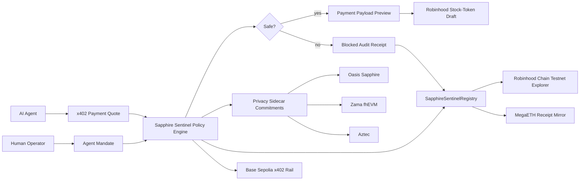

# Architecture

Sapphire Sentinel is a buyer-side control plane for autonomous agents that need
to buy paid data or draft RWA actions.



## Runtime Surfaces

| Layer | What It Does |
|---|---|
| Flask demo | Judge-facing control surface and API |
| Policy engine | Checks domain, action, amount, budget, prompt-injection, secret-egress, nonce, and privacy commitments |
| x402 model | Simulates v2 payment quote, `PAYMENT-REQUIRED` header shape, nonce replay checks, and optional EIP-712 payer recovery |
| Network registry | Labels Robinhood, Base, MegaETH, Zama, and Aztec roles without over-claiming |
| Privacy module | Produces labeled Oasis Sapphire, Zama fhEVM, and Aztec commitments |
| Privacy proof bundle | Exports local Zama/Aztec proof envelopes with private witnesses redacted |
| Contract | Records mandates and payment evaluations on Robinhood Chain testnet |

## Deployment

`SapphireSentinelRegistry` is live and source-verified on Robinhood Chain
testnet.

- Address: `0x2EBB91F7B376cB821d90ac4A7d77B0d06b70B36F`
- Transaction: `0xc53ab8fc8cdab4ce7ef5f09fd56fc564756fd8d5e5b7c0396238878d6cc84975`
- Explorer: `https://explorer.testnet.chain.robinhood.com/address/0x2EBB91F7B376cB821d90ac4A7d77B0d06b70B36F`

`scripts/deploy_registry.py` can compile the same registry for other configured
EVM testnets, starting with MegaETH testnet:

```bash
python3 scripts/deploy_registry.py --network megaeth_testnet --dry-run
python3 scripts/generate_privacy_proofs.py
python3 scripts/sign_x402_payment.py --header-only
```

## Safety Boundary

The default demo never settles live x402 payments, never submits Robinhood
orders, never sends Telegram messages, never reads secrets, and never uses real
funds. All action drafts are testnet or paper-only.
